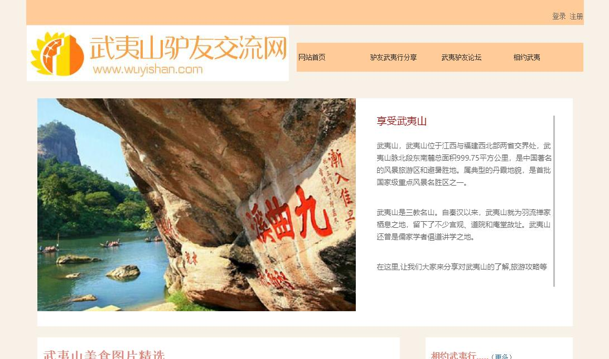

# 毕业设计

利用Thinkphp框架,简单的2次开发实现。
作为自己毕业设计，适用大学毕设。

-----
## 题目：武夷山旅游网

*毕设题目:武夷山驴友交流门户网站 （主要是旅游网重复太多）*

**说明**：本课题主要讨论基于ThinkPHP框架的web应用系统开发过程，能运用ThinkPHP框架基本知识，网页设计知识，MYSQL数据库知识开展本次毕业设计工作。

#### 系统的主要功能:

武夷山驴友交流门户网站的主要功能分为前台和后台两部分。系统前台部分功能：武夷山旅游美食攻略展示、武夷山旅游景点攻略展示、武夷山旅游民宿攻略展示、用户注册登录、用户论坛、用户武夷山线下邀约等。系统后台部分功能：用户信息管理、用户发布攻略管理、论坛话题审核等。

网站的主要功能如上，中间的一些细节根据实际情况自由发挥和处理，使网站具有实用性。

#### 简单页面展示：

下图所示的界面是武夷山驴友交流门户网站系统的前台首页

下图所示的界面是驴友武夷行分享界面

下图所示的界面是武夷山驴友交流门户网站系统的后台首页

#### 主要的数据库表

**wuyi_users(用户表)**

| 字段 | 类型 | 是否为空 | 解释 |
| ------ | ------ | ------ | ------ |
| Uid | int | Not null | 用户ID,主键,自增 |
|Name	|varchar	|Not null	|用户昵称|
|Pass|	varchar|	Not null|	账号密码|
|Sex	|int	|Null	|性别|
|Age|	int	|Null|	年龄|
|Phone|	varchar|	Null|	电话|
|Email|	varchar	|Not Null|	登录邮箱|
|Photo|	varchar	|Null|	用户头像|
|City|	varchar	|Null|	城市|
|State|	int	Not |Null|	账号状态|

**wuyi_diary(驴友武夷行分享表)**

| 字段 | 类型 | 是否为空 | 解释 |
| ------ | ------ | ------ | ------ |
|Did	|int	|Not null	|攻略ID,主键,自增|
|Title	|varchar|	Not null|	分享攻略标题|
|Uid	|int	|Not null|	发布用户的id|
|Like_num|	int	|Not null|	点赞数|
|Picture|	varchar|	Null|	图片信息|
|Content|	varchar	|Not Null|	内容信息|
|Type	|int	|Not Null|	所属分类|
|State	|int	|Not Null|	分享攻略状态|
|Addtime|	int	|Not Null|	添加时间|

其他的表导入wuyishanlvyou.sql后可自行查看。

#### 总结

仅供参考学习使用，不得用于商业项目。(当然啦，这么丑也不会用人用于商业。)